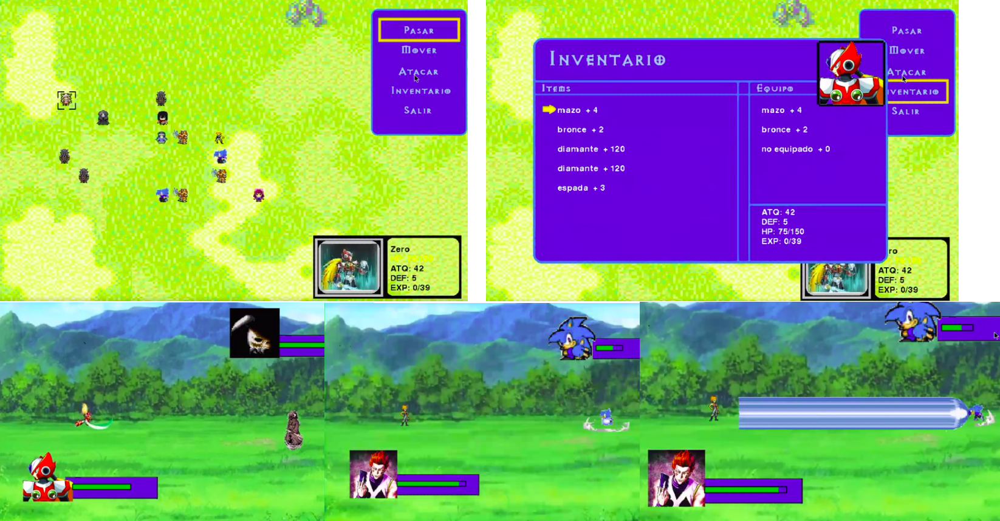

# Trabajo de titulo UTFSM - Juego RPG tactico

Proyecto de red social multiplataforma

## Construido con 🛠️

* Librería Pygame
* Python 2.7

## Screenshot

[VideoDemo](https://drive.google.com/file/d/1uzLFazwiEtSXMGWIAdsnqirCwrY0KnDG/view)

## Versionado 📌

Uso [GIT](https://git-scm.com/) para el versionado.
Puedes ver los comandos que uso [aqui](https://nacholabraweb.000webhostapp.com/docs/Tutoriales.html)

## Licencia 📄
Este proyecto está bajo la Licencia (MIT)
Creado por Ignacio Labra
